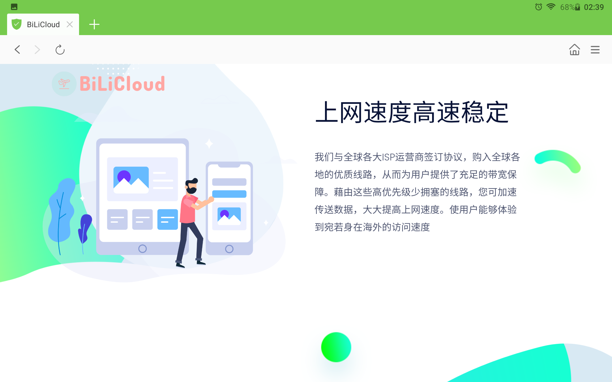
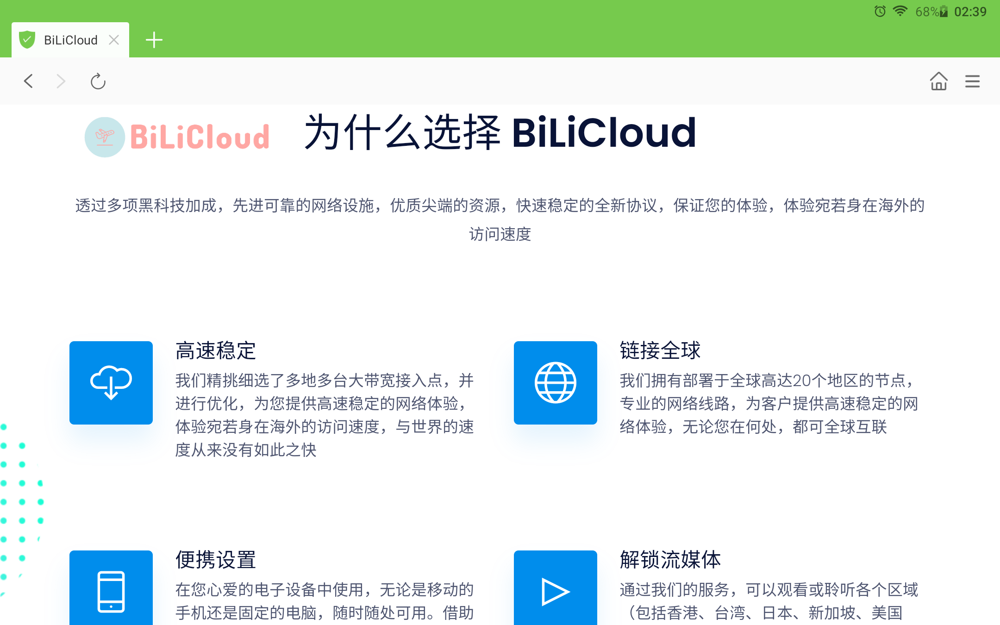
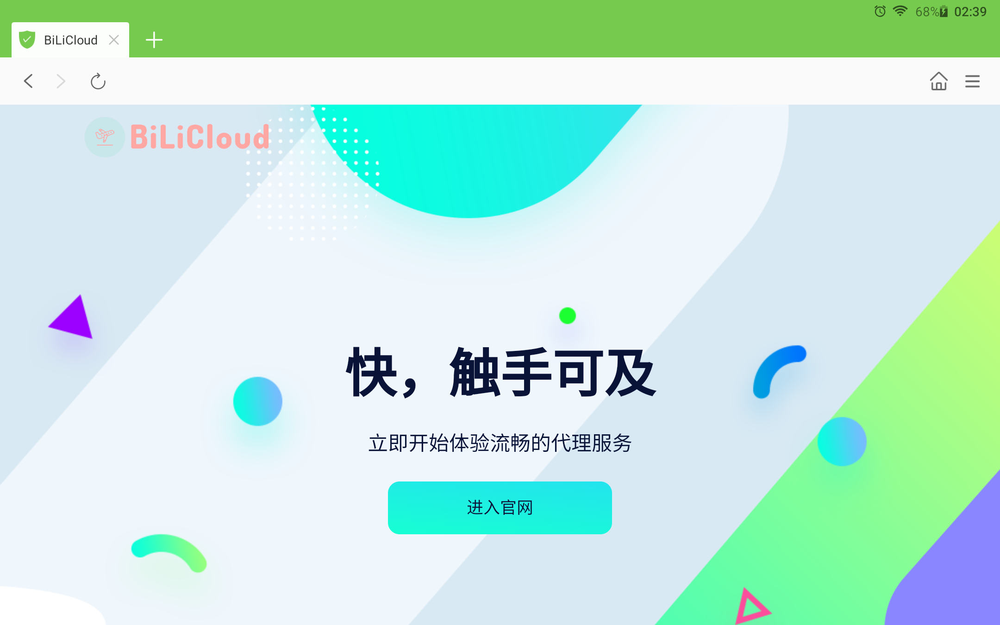

# V2boardLoadingPageTheme
23.11.27 丢文件了，没传完。。。。
v2board面板的落地页主题，修改自whmcs主题

下载压缩包上传到public目录
解压
宝塔默认文档index.html放第一位
index.php第二位
需要修改的内容在index.html里
bug:已知v2board用户登录掉了之后跳转不到登录界面需要自行修改v2board主题css

预览:  

